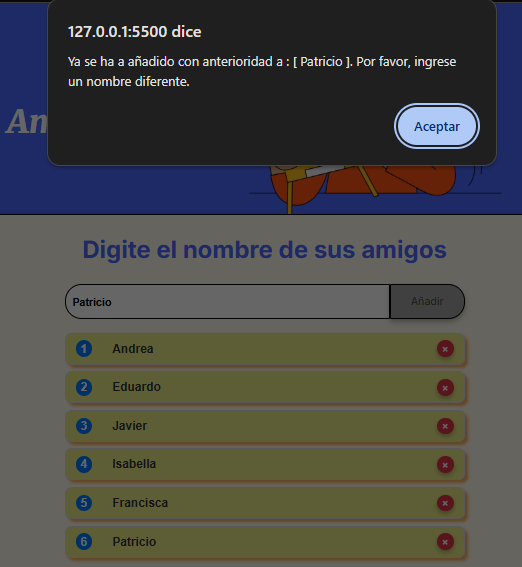

# Amigo Secreto

Amigo Secreto, es un desarrollo web solicitado por Alura para el programa de capacitación Oracle ONE, este desarrollo web tiene por objeto, permitir al usuario ingresar nombres de sus amigos y luego realizar un sorteo aleatorio para determinar quien es el amigo secreto.

## Interfaz de Usuario

  

## Uso de la Aplicación

* Para agregar "Amigos" para el sorteo, los nombres de los amigos debebn ingresarse a través de la caja de texto referenciada con frase "Escribir un nombre" y luego hacer clic en botón [Añadir]

  

* Cada vez que se agregue un nombre, este se agregará a una lista que estará bajo la caja de texto de entrada de nombres.

  

* Sorteo del amigo secreto al azar: Idealmente, para que tenga sentido, por lo menos debería añadir a la lista de amigos un minio de 2 nombres  como maximo no hay un limite, salvo lo maximo que pueda soportar el hardware del equipo cliente y la renderización del navegador(en teoría); en el momento en que la lista de amigos esté completa, para realizar el sorteo, haga clic en botón [ Sortear amigo ].

  

  Y el resultado será similar a la imagen siguiente:

  

## Excepciones y validaciones

* Intento de añadir vacio o solo uno o más espacios en blanco

  

  La web valida si no se ha ingresado nada o solo espacios en blanaco al momento de hacer clic en Añadir, en caso de ser uno de estos casos, envia un mensaje indicando "Por favor, inserte un nombre"; en caso de pasar la validación, pasará al proceso de Añadir el nuevo nombre a la lista de amigos.
  
* Repetición de nombre de amigo:

  
  
  Al pasar al proceso de Añadir el nuevo nombre a la lista de amigos, validará si el nuevo nombre ingresado ya existe en la lista de amigos, si existe, notificará con un mensajes de "Ya se ha agregado con anterioridad a: [el nombre duplicado]"; si el [el nombre duplicado] no existe en la lista, entonces termina agregándolo a la lista de amigos y renderizarla en la misma página web.

## Requerimientos

  Los requerimientos son mínimos, fuera de la siguiente lista, no requiere una instalación como tal de la web Amigo Secreto:
  
* Navegador web.
* Soporte para javascript por el navegador
* Terner habilitada a ejecución de script en el navegador

# Link de web publicada en GitHub Pages

  <a href="https://eduardooyfl.github.io/challenge-amigo-secreto-g9/">Web de "Challenge Amigo Secreto"</a>
