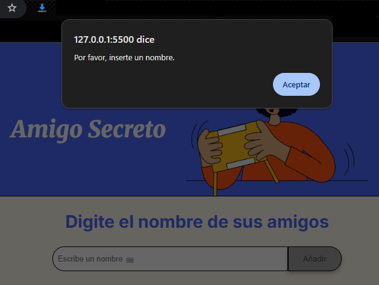

# Amigo Secreto

Amigo Secreto, es un desarrollo web solicitado por Alura para el programa de capacitación Oracle ONE, este desarrollo web tiene por objeto, permitir al usuario ingresar nombres de sus amigos y luego realizar un sorteo aleatorio para determinar quien es el amigo secreto.

## Interfaz de Usuario

  

## Funcionamiento de la Aplicación

* Para agregar "Amigos" para el sorteo, los nombres de los amigos deben ingresarse a través de la caja de texto referenciada con frase "Escribe un nombre ⌨️" y luego hacer clic en botón [Añadir]

   También , puede "Añadir" con un ENTER.

* Cada vez que se agregue un nombre, este se agregará a una lista que estará bajo la caja de texto de entrada de nombres.

  

* Sorteo del amigo secreto al azar: Idealmente, para que tenga sentido, por lo menos debería añadir a la lista de amigos un minio de 2 nombres  como maximo no hay un limite, salvo lo maximo que pueda soportar el hardware del equipo cliente y la renderización del navegador(en teoría); en el momento en que la lista de amigos esté completa, para realizar el sorteo, haga clic en botón [ Sortear amigo ].

  

  Y el resultado será similar a la imagen siguiente:

  

## Excepciones y validaciones

* <strong>Sobre el alfabeto y los caracteres aceptados</strong>

  El alfabeto de entrada aceptado es el español minúculas [a-z], mayúsculas [A-Z], las letras [Ñ,ñ], volcales acentuadas mayúsculas/minusculas y el caracter ['] comilla simple; sin distinción entre mayúsculas ni minúsculas.
    
* <strong>Intento de añadir vacio o solo uno o más espacios en blanco.</strong> Al intentar añadir un amigo sin haber escrito un caracter(cadena vacía) o un nombre escrito con un texto de solo 1 o más espacios, la web validará esta entrada de texto  y comunicará al usuario "Por favor, inserte un nombre." 

  

  Cuando se efectúe el ingreso de texto ya sea por medio de pulsación de tecla ENTER o botón [ Añadir ], la web valida, la webhará la misma validación; en caso de pasar la validación, el NOMBRE ingresado pasará a la lista de amigos.
  
* <strong>Repetición de nombre de amigo:</strong>

  
  
  Al pasar al proceso de Añadir el nuevo nombre a la lista de amigos, validará si el nuevo nombre ingresado ya existe en la lista de amigos, si existe, notificará con un mensajes de "Ya se ha agregado con anterioridad a: [el nombre duplicado]", luego de aceptar la notificación, no se agregara el nombre para evitar duplicados y se mantiene el nombre en la caja de texto, a la espera de que se elimine o modifique manualmente, ya que por ejemplo, en la imagen de muestra, en vez de "Patricio" podria haberse intentado ingresar "Patricia" y solo haya sido error humano de escritura; si el [el nombre ingresado] no existe en la lista, entonces termina agregándolo a la lista de amigos y renderizarla en la misma página web, borrando el nombre escrito en la caja de texto.

* <strong>Contexto de datos repetidos</strong>

  En el contexto de datos repetidos, de acuerdo al alfabeto aceptado, vocales acentuadas,caracteres permitidos y las validaciones de espacios en blanco, se debe considerar lo siguiente:
  - <strong>Los espacios en blanco en blanco consecutivos entre textos</strong>, sin imortar la cantidad, se reduciran a uno solo, es decir, que al registrar un amigo, " " será lo mismo que "&nbsp;&nbsp;&nbsp;&nbsp;&nbsp; ", por ejemplo, si añade "Santa María" e intenta añadir "Santa     María", el segundo intento será equivalente a "Santa María", por lo tanto, no se registrará por considerarse un DUPLICADO.

  - <strong>Mayúsculas/Minúsculas</strong>, letras, vocales y vocales acentuadas, considerando que en lenguaje humano una palabra tiene el mismo significado ya sea en mayúsculas o minúsculas, parcial o completamente en Mayúscula/Minúscula, la validación realizada al añadir un nombre a la lista de amigos, no hará distinción entre mayusculas y minúsculas, por lo que los siguientes textos serán iguales y por ende considerados duplicados:
 

      + María = MAría = marÍa = MARÍA
 

      + Santa María = Santa MarÍA = santa maría = santa          María
 

  - <strong>Palabras con vocales con o sin acento</strong>, además de no distinguir entre mayúsculas y minúsculas, tampoco hace distiinción entre palabras con vocales acentuadas o no, por ejemplo:
 
  
      + Santa María = Santa       mária = Santa Maria = SÁNTÁ        MárÍÁ
 
        

## Requerimientos

  Los requerimientos son mínimos, fuera de la siguiente lista, no requiere una instalación como tal de la web Amigo Secreto:
  
* Navegador web.
* Soporte para javascript por el navegador
* Terner habilitada a ejecución de script en el navegador

# Link de web publicada en GitHub Pages

  <a href="https://eduardooyfl.github.io/challenge-amigo-secreto-g9/">Web de "Challenge Amigo Secreto"</a>
