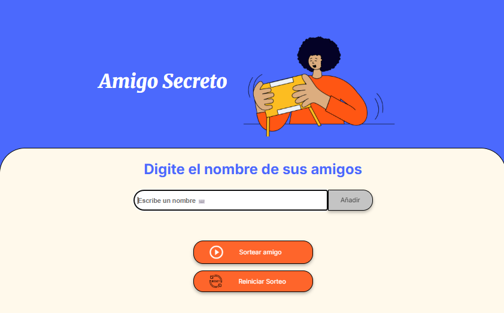
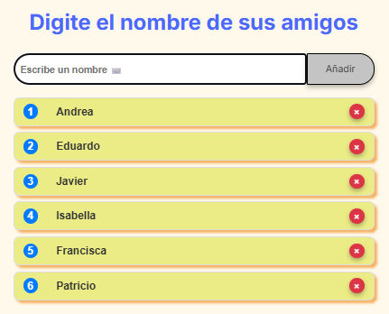

# Challenge: Amigo Secreto Esp G9 - Oracle ONE, Agosto de 2025 Chile

Amigo Secreto, es un desarrollo web solicitado por Alura para el programa de capacitación Oracle ONE, este desarrollo web tiene por objeto, permitir al usuario ingresar nombres de sus amigos y luego realizar un sorteo aleatorio para determinar quien es el amigo secreto.

## Interfaz de Usuario

## Uso de la Aplicación

- Para agregar "Amigos" para el sorteo, los nombres de los amigos debebn ingresarse a través de la caja de texto referenciada con frase "Escribir un nombre" y luego hacer clic en botón [Añadir]

Cada vez que se agregue un nombre, este se agregará a una lista que estará bajo la caja de texto de entrada de nombres.

Sorteo del amigo secreto al azar: Idealmente, para que tenga sentido, por lo menos debería añadir a la lista de amigos un minio de 2 nombres  como maximo no hay un limite, salvo lo maximo que pueda soportar el hardware del equipo cliente y la renderización del navegador(en teoría); en el momento en que la lista de amigos esté completa, para realizar el sorteo, haga clic en botón [ Sortear amigo ].

Y el resultado será similar a la imagen siguiente:

